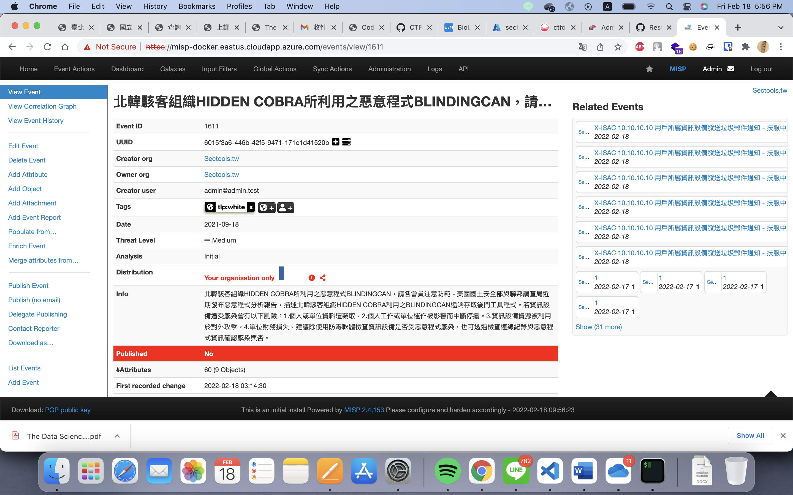

# STIXtoMISP_v1.0

一個轉換 STIX2.1 檔案到 MISP 的工具

## 安裝方式

        pip3 install -r requirements.txt      

## 使用方法

1. 設定 misp_config.yml
2. 將要上傳的 STIX2.1(JSON) 放置在 ImportFile 資料夾中
3. 執行 python3 stix2misp.py
4. 執行會產生一些 Log 會產生在 Logs 資料夾中，方便除錯

#### misp_config.yml

        MISP:
            URL: https://misp-docker.eastus.cloudapp.azure.com/
            KEY: 8p0XDV1BG4QMSrgqZQEQJDIKmpzhTjjDRZOp5dl0
            VERIFYCERT: False
        
#### 欄位意義
URL -> MISP Server 位置 

KEY -> MISP API Key

VERIFYCERT -> MISP Server 沒有信任憑證時請設 False

## 運行結果

## sectoolstw-objects

放至自定義的 Misp-Objects

### 範例 definition.json

        {
            "description": "DLRA-software",
            "meta-category": "sectoolstw",
            "name": "software",
            "required": [
                "id"
            ],
            "uuid": "d65cbba2-059c-4da8-95e5-12711944add3",
            "version": 4,
            "attributes": {
            "id": {
                "description": "id",
                "disable_correlation": true,
                "misp-attribute": "text",
                "ui-priority": 0
            },
            "spec_version": {
                "description": "spec_version",
                "disable_correlation": false,
                "misp-attribute": "text",
                "ui-priority": 0
            }
        }   

## 開發參考內容
1. [PyMISP 教學](/tutorial.ipynb) 
2. [STIX to MISP Mapping Document](https://github.com/MISP/misp-stix/tree/main/documentation)
3. [stix2 Example](https://oasis-open.github.io/cti-documentation/examples/identifying-a-threat-actor-profile)
4. [Log 模組設置](https://docs.python.org/zh-tw/3/howto/logging.html)
